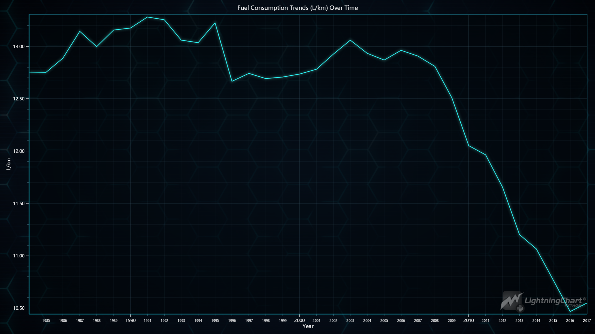
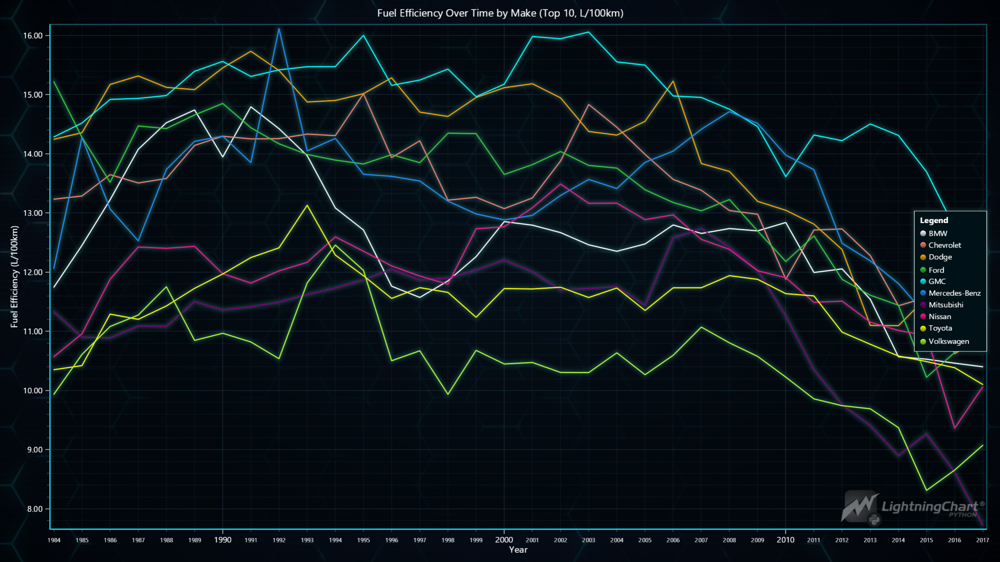
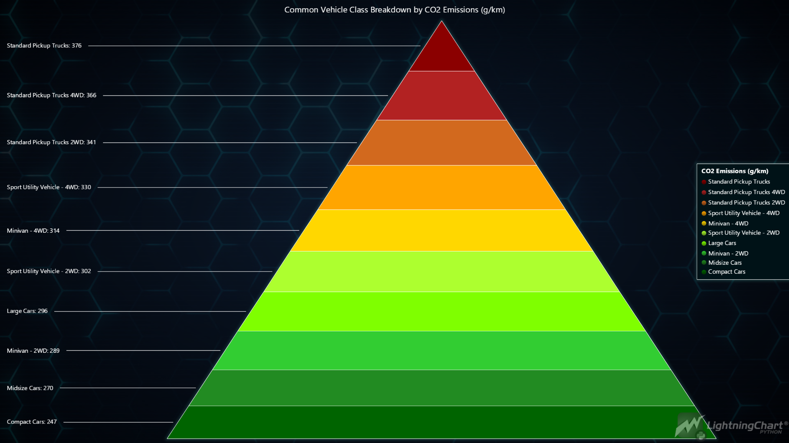
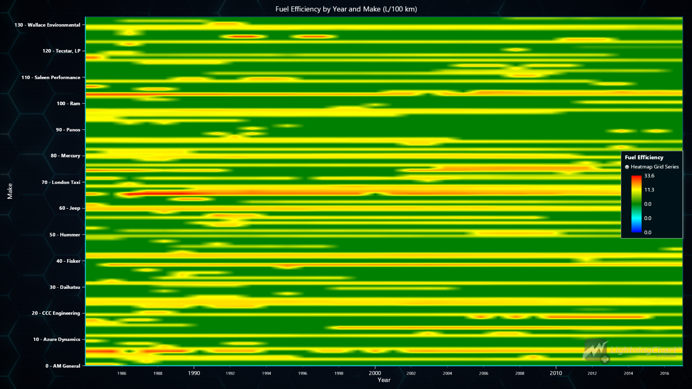
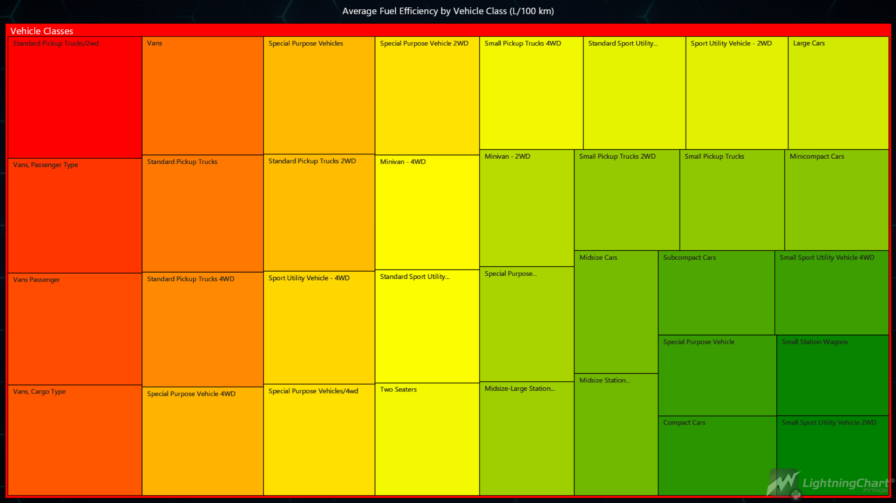
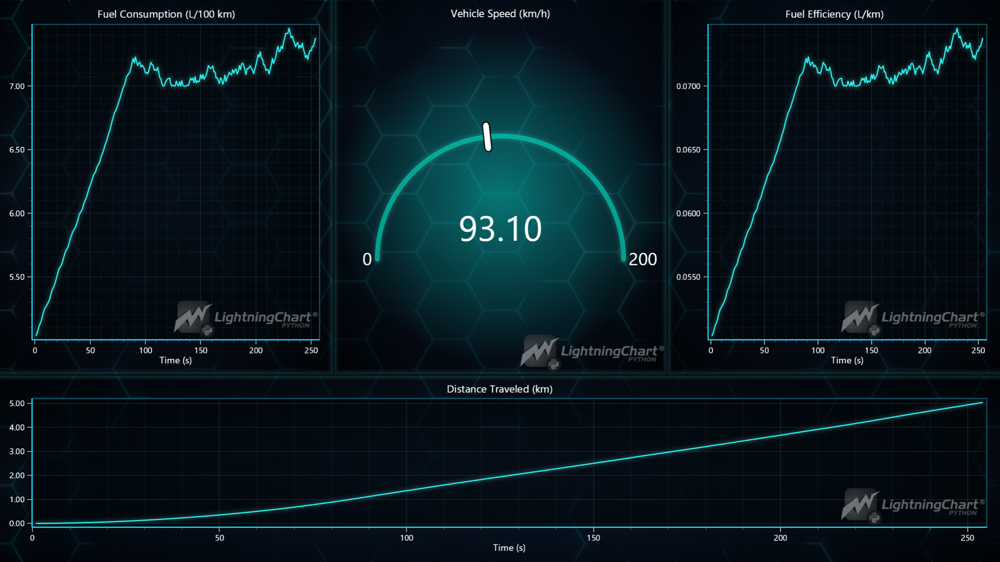

# Vehicle Fuel Consumption Python Data Analysis Application

## Introduction

This project focuses analyzes and visualizes vehicle fuel consumption using **LightningChart Python**, a high-performance data visualization library. The goal is to gain insights into fuel consumption patterns, efficiency metrics, and the impact of acceleration on fuel usage.

The project is divided into two main components:

1. **fuel.ipynb**: A Jupyter Notebook that showcases different visualizations based on the dataset.
2. **dashboard_acceleration.py**: A Python script that creates a real-time dashboard simulating vehicle acceleration, fuel consumption, and efficiency.

## LightningChart Python

**LightningChart Python** is a powerful library for creating high-performance, interactive visualizations, especially when handling large datasets. It's
ideal for real-time data simulation applications, making it an excellent choice for this fuel consumption project. LightningChart Python allows us to build dynamic and interactive charts that respond smoothly to data updates, enhancing vehicle fuel consumption data analysis and presentation.

## **Setting Up Python Environment**

To set up the Python environment for this project, you need to install Python and the necessary libraries. This includes installing LightningChart Python, Pandas and Numpy.

Here's a quick setup guide:

1. **Install Python**: Download and install the latest version of Python from the [official website](https://www.python.org/).
2. **Install Libraries**: Use `pip` to install the required libraries:

   ```bash
   pip install lightningchart pandas numpy
   ```
3. Set up your development environment by creating a new project directory and installing the required libraries. Ensure that LightningChart Python is properly licensed.

### **Overview of libraries used**

- **Pandas**: For data manipulation and analysis. ([documentation](https://pandas.pydata.org/docs/))
- **Numpy**: For numerical operations. ([documentation](https://numpy.org/))
- **LightningChart Python**: For creating high-performance, interactive data visualizations. ([documentation](https://lightningchart.com/python-charts/docs/))

### Working with Jupyter Notebooks in Visual Studio Code

If you're using Visual Studio Code (VSCode) as your development environment, you can run Jupyter notebooks directly within it, which offers a seamless experience.

#### Installing VSCode, Python Extension and Jupyter Extension

1. **Install Visual Studio Code** : If you haven't installed it, download it from the [official website](https://code.visualstudio.com/).
2. **Install the Python Extension**
   * Open VSCode.
   * Go to the "Extensions" by clicking its icon in the Activity Bar on the left side of the window.
   * Search for the "Python" extension by Microsoft and install it.
3. **Install the Jupyter Extension:**
   * In the "Extensions" view, search for "Jupyter" and install the extension by Microsoft.
   * This allows you to run Jupyter notebooks `.ipynb` files directly within VSCode.

## Overview of the Data

The Vehicle Fuel Consumption dataset includes extensive information on vehicle attributes such as make, model, year, and class. It provides essential fuel efficiency metrics, including city and highway miles per gallon (MPG) and CO₂ emissions data in grams per mile. This data enables analysis of fuel consumption patterns, vehicle performance comparisons, and environmental impact assessments across various vehicle classes and types.

## Loading and Processing Data

This snippet loads the dataset, converts fuel efficiency and CO₂ emissions to metric units, and drops the original imperial columns. Finally, it checks the dataset structure and any missing values.

```python
# Load the dataset
dataset = 'fuel.csv'
vehicle_fuel = pd.read_csv(dataset)

# Convert units to metric
vehicle_fuel['fuel_efficiency_l_per_100km'] = 235.215 / vehicle_fuel['combined_mpg_ft1'].replace(0, float('nan'))
vehicle_fuel['co2_emissions_g_per_km'] = vehicle_fuel['tailpipe_co2_in_grams_mile_ft1'] / 1.60934

# Drop the original imperial columns if they are no longer needed
vehicle_fuel = vehicle_fuel.drop(columns=['combined_mpg_ft1', 'tailpipe_co2_in_grams_mile_ft1'])

# Display basic information about the updated dataset and check for missing values
vehicle_fuel.info()
vehicle_fuel.isnull().sum()
```

This snippet cleans the data by removing rows with missing or zero values in key columns. It then groups the data by `year`, calculating the average fuel efficiency (L/100 km) for each year to observe trends.

```python
# Drop NaN values in 'year' and 'fuel_efficiency_l_per_100km' columns
vehicle_fuel_clean = vehicle_fuel.dropna(subset=['year', 'fuel_efficiency_l_per_100km'])

# Remove rows where fuel efficiency is 0 or missing (NaN)
vehicle_fuel_clean = vehicle_fuel_clean[vehicle_fuel_clean['fuel_efficiency_l_per_100km'] > 0]

# Group data by year and calculate the average liters per 100 km per year
fuel_efficiency_trend = vehicle_fuel_clean.groupby('year')['fuel_efficiency_l_per_100km'].mean().reset_index()

# Display the processed data to ensure it's correct
fuel_efficiency_trend.head()
```

This function converts a series of years to UNIX timestamps in milliseconds, useful for consistent time-based plotting.

```python
def convert_year_to_unix_timestamps(year_series):
    return (pd.to_datetime(year_series, format='%Y').astype('int64') // 10**6).tolist() # Convert to milliseconds
```

## Visualizing Data with LightningChart Python

This section demonstrates various visualizations to analyze fuel consumption patterns. Using **LightningChart Python**, we explore trends and relationships within the data.

### Fuel Consumption Over Time (Line Chart)

This line chart visualizes historical fuel consumption trends, represented as average liters per 100 kilometers (L/100 km) over the years. Converting the year column to UNIX timestamps enables consistent time-based plotting, highlighting efficiency improvements over time.

```python
# Convert years to Unix timestamps
x_values = convert_year_to_unix_timestamps(fuel_efficiency_trend['year'])

# Extract y_values as before
y_values = fuel_efficiency_trend['fuel_efficiency_l_per_100km'].tolist()

# Create the chart
chart = lc.ChartXY(
    theme=lc.Themes.TurquoiseHexagon,
    title='Fuel Consumption Trends (L/km) Over Time'
)

# Customize the chart axes labels
x_axis = chart.get_default_x_axis()
x_axis.set_tick_strategy('DateTime')
x_axis.set_title('Year')
chart.get_default_y_axis().set_title('L/km')

# Add line series to the chart
series = chart.add_line_series(data_pattern="ProgressiveX").append_samples(
    x_values=x_values,
    y_values=y_values
)

# Open the chart
chart.open()
```



### Fuel Efficiency Over Time Year by Make (Top 10)

This line chart displays fuel efficiency trends over time for the top 10 vehicle makes, helping to differentiate efficiency improvements across manufacturers. Each line represents a different car make, allowing for easy comparison of fuel efficiency performance over the years.

```python
# Clean and filter data, removing rows with missing or very low fuel efficiency values
vehicle_fuel_clean = vehicle_fuel.dropna(subset=['year', 'make', 'fuel_efficiency_l_per_100km'])
vehicle_fuel_clean = vehicle_fuel_clean[vehicle_fuel_clean['fuel_efficiency_l_per_100km'] > 0.01]

# Find the top 10 most common car makes to limit the lines in the chart
top_makes = vehicle_fuel_clean['make'].value_counts().nlargest(10).index
filtered_data = vehicle_fuel_clean[vehicle_fuel_clean['make'].isin(top_makes)]

# Group data by year and make, calculating average fuel efficiency
fuel_efficiency_data = filtered_data.pivot_table(
    index='year', columns='make', values='fuel_efficiency_l_per_100km', aggfunc='mean'
).fillna(0)

# Define a custom color palette
vibrant_colors = [
    lc.Color('white'), lc.Color('salmon'), lc.Color('orange'), lc.Color('limegreen'),
    lc.Color('cyan'), lc.Color('dodgerblue'), lc.Color('purple'), lc.Color('deeppink'),
    lc.Color('yellow'), lc.Color('greenyellow')
]

# Initialize the chart
chart = lc.ChartXY(
    theme=lc.Themes.TurquoiseHexagon,
    title='Fuel Efficiency Over Time by Make (Top 10, L/100km)'
)

# Convert years to Unix timestamps
x_values = convert_year_to_unix_timestamps(co2_emissions_trend['year'])

# Plot a line for each top car make with colors from the custom palette
for idx, car_make in enumerate(fuel_efficiency_data.columns):
    y_values = fuel_efficiency_data[car_make].tolist()
    series = chart.add_line_series()
    series.set_name(car_make)
    series.append_samples(x_values=x_values, y_values=y_values)
  
    # Set a color from the custom palette
    series.set_line_color(vibrant_colors[idx % len(vibrant_colors)])

# Configure the X-axis for DateTime display
x_axis = chart.get_default_x_axis()
y_axis = chart.get_default_y_axis()
x_axis.set_title('Year')
y_axis.set_title('Fuel Efficiency (L/100km)')
x_axis.set_tick_strategy('DateTime')

# Add a legend to display each car make
chart.add_legend(data=chart)
chart.set_cursor_mode('show-nearest') # Set cursor mode

# Open the chart
chart.open()
```



### Common Vehicle Class Breakdown by CO₂ Emissions (Pyramid Chart)

This pyramid chart displays the average CO₂ emissions (g/km) for common vehicle classes, sorted in descending order. Each slice represents a vehicle class, with the top sections indicating higher emissions. This visualization allows for a quick comparison of CO₂ emissions among popular vehicle types, highlighting which classes contribute more to emissions.

```python
# Define the emissions color palette using named colors
emissions_colors = [
    lc.Color('darkred'),      # Dark red for very high emissions
    lc.Color('firebrick'),    # Firebrick red
    lc.Color('chocolate'),    # Dark orange for high emissions
    lc.Color('orange'),       # Orange for moderately high emissions
    lc.Color('gold'),         # Gold for mid-range emissions
    lc.Color('greenyellow'),  # Yellow-green for mid to low emissions
    lc.Color('chartreuse'),   # Chartreuse green for lower emissions
    lc.Color('limegreen'),    # Lime green for low emissions
    lc.Color('forestgreen'),  # Forest green for very low emissions
    lc.Color('darkgreen')     # Dark green for the lowest emissions
]

# Filter to only include common vehicle classes
common_classes = [
    'Compact Cars', 'Large Cars', 'Midsize Cars',
    'Minivan - 2WD', 'Minivan - 4WD',
    'Sport Utility Vehicle - 2WD', 'Sport Utility Vehicle - 4WD',
    'Standard Pickup Trucks', 'Standard Pickup Trucks 2WD', 'Standard Pickup Trucks 4WD'
]
filtered_data = vehicle_fuel_clean[vehicle_fuel_clean['class'].isin(common_classes)]

# Calculate the average CO2 emissions for these common vehicle classes in grams per kilometer
vehicle_co2_emissions = filtered_data.groupby('class')['co2_emissions_g_per_km'].mean().reset_index()

# Prepare the data for the Pyramid Chart with metric units
pyramid_data = [
    {'name': row['class'], 'value': row['co2_emissions_g_per_km']}
    for _, row in vehicle_co2_emissions.iterrows()
]

# Sort data in descending order to have the largest CO2 emissions at the top
pyramid_data = sorted(pyramid_data, key=lambda x: x['value'], reverse=True)

# Create the Pyramid Chart
chart = lc.PyramidChart(
    slice_mode='height',
    theme=lc.Themes.TurquoiseHexagon,
    title='Common Vehicle Class Breakdown by CO2 Emissions (g/km)'
)

# Add the data slices to the pyramid chart
chart.add_slices(pyramid_data)

# Apply the custom color palette to the slices
chart.set_slice_colors(emissions_colors)

# Add a legend to explain the chart's purpose
chart.add_legend().add(chart).set_title('CO2 Emissions (g/km)')

# Open the chart
chart.open()
```



### Fuel Efficiency Over Time and Make (Heatmap)

The heatmap visualizes average fuel efficiency (L/100 km) across vehicle makes by year, using a color gradient to indicate efficiency levels. A custom color palette ranges from blue (high efficiency) to red (low efficiency), revealing trends and variations in fuel efficiency across manufacturers and over time.

```python
# Clean and filter data, removing rows with missing or zero fuel efficiency values
vehicle_fuel_clean = vehicle_fuel.dropna(subset=['year', 'make', 'fuel_efficiency_l_per_100km'])
vehicle_fuel_clean = vehicle_fuel_clean[vehicle_fuel_clean['fuel_efficiency_l_per_100km'] > 0.01]

# Extract unique years and sort them to create a list for timestamps
year_labels = sorted(vehicle_fuel_clean['year'].unique())
year_labels_unix = convert_year_to_unix_timestamps(year_labels)

# Group data by year and make, calculating average fuel efficiency in liters per 100 kilometers
fuel_efficiency_data = vehicle_fuel_clean.pivot_table(
    index='year', columns='make', values='fuel_efficiency_l_per_100km', aggfunc='mean'
).fillna(0)

# Convert data to numpy array and get make labels
heatmap_data = fuel_efficiency_data.to_numpy()
make_labels = fuel_efficiency_data.columns.tolist()

# Define grid dimensions
grid_size_x, grid_size_y = int(heatmap_data.shape[0]), int(heatmap_data.shape[1])

# Create the chart
chart = lc.ChartXY(title='Fuel Efficiency by Year and Make (L/100 km)', theme=lc.Themes.TurquoiseHexagon)

# Configure the heatmap with start and end values, steps, and intensity values
heatmap_series = chart.add_heatmap_grid_series(columns=grid_size_x, rows=grid_size_y)
heatmap_series.set_start(x=year_labels_unix[0], y=0)
heatmap_series.set_end(x=year_labels_unix[-1], y=grid_size_y)
heatmap_series.set_step(x=1, y=1)
heatmap_series.set_intensity_interpolation(True)
heatmap_series.invalidate_intensity_values(heatmap_data.tolist())
heatmap_series.hide_wireframe()

# Define and apply a custom color palette for intensity visualization
custom_palette = [
    {"value": float(np.nanmin(heatmap_data)), "color": lc.Color('blue')},
    {"value": float(np.percentile(heatmap_data, 25)), "color": lc.Color('cyan')},
    {"value": float(np.median(heatmap_data)), "color": lc.Color('green')},
    {"value": float(np.percentile(heatmap_data, 75)), "color": lc.Color('yellow')},
    {"value": float(np.nanmax(heatmap_data)), "color": lc.Color('red')}
]
heatmap_series.set_palette_colors(steps=custom_palette, look_up_property='value', interpolate=True)

# Configure axis titles and set the X-axis to use DateTime strategy
x_axis = chart.get_default_x_axis()
y_axis = chart.get_default_y_axis()
x_axis.set_title('Year')
y_axis.set_title('Make')
x_axis.set_tick_strategy('DateTime')

# Add custom ticks for every 10th make on the Y-axis with index numbers
for i in range(0, len(make_labels), 10):  # Step by 10 to select every 10th make
    make = make_labels[i]
    custom_tick = y_axis.add_custom_tick()
    custom_tick.set_value(i)
    custom_tick.set_text(f"{i} - {make}")  # Display index and make name
    custom_tick.set_marker_font(12, family='Segoe UI, sans-serif', weight='bold')

# Hide default Y-axis labels to keep only every 10th make label
y_axis.set_tick_strategy('Empty')

# Add a legend and open the chart
chart.add_legend(data=heatmap_series, title='Fuel Efficiency')
chart.open()
```



### Average Fuel Efficiency by Vehicle Class (Treemap)

This treemap chart visualizes the average fuel efficiency (L/100 km) across various vehicle classes. Each rectangle represents a vehicle class, with color intensity indicating fuel efficiency: red represents lower efficiency (higher fuel consumption), yellow is moderate, and green indicates higher efficiency (lower fuel consumption). This visualization helps in quickly identifying the most and least fuel-efficient vehicle classes.

```python
# Calculate the average fuel efficiency in L/100 km by vehicle class for all available classes
average_l_per_100km_by_class = vehicle_fuel.groupby('class')['fuel_efficiency_l_per_100km'].mean().dropna().sort_values()

# Prepare data for the treemap with L/100 km values
data = [{'name': vehicle_class, 'value': l_per_100km} for vehicle_class, l_per_100km in average_l_per_100km_by_class.items()]

# Create the TreeMapChart
chart = lc.TreeMapChart(
    theme=lc.Themes.TurquoiseHexagon,
    title="Average Fuel Efficiency by Vehicle Class (L/100 km)"
)

# Set node coloring based on L/100 km values
chart.set_node_coloring(
    steps=[
        {'value': average_l_per_100km_by_class.max(), 'color': lc.Color('red')},    # Higher L/100 km (less efficient)
        {'value': average_l_per_100km_by_class.mean(), 'color': lc.Color('yellow')},
        {'value': average_l_per_100km_by_class.min(), 'color': lc.Color('green')},  # Lower L/100 km (more efficient)
    ],
)

# Set the data
chart.set_data([{'name': 'Vehicle Classes', 'children': data}])

# Open the chart
chart.open()
```



### Dashboard Visualization (Real-Time Simulation)

The `dashboard_acceleration.py` script simulates a real-time dashboard tracking speed, fuel consumption, efficiency, and distance traveled. Using techniques like simulated acceleration, speed fluctuation, and cumulative distance tracking, the dashboard dynamically demonstrates how driving conditions impact fuel consumption and efficiency.

Key components include:

* **Fuel Consumption** : A line chart showing real-time consumption.
* **Speed Gauge** : A gauge displaying the vehicle's speed.
* **Fuel Efficiency** : A line chart for fuel efficiency trends.
* **Distance Traveled** : A cumulative distance tracker.

The full code is available in the repository for those interested in exploring its details.

**Note:** Running this dashboard requires a **LightningChart Python** license.




## Additional Visualizations

For readers with a **LightningChart Python** license, the notebook file (`fuel.ipynb`) offers even more visualizations beyond those highlighted here, including area, donut, and bar charts. These additional charts provide further insights into fuel consumption and efficiency, offering a more in-depth view of the dataset.

## Conclusion

The *Vehicle Fuel Consumption Python Data Analysis Application* demonstrates using **LightningChart Python** for high-performance data visualization. Through various visualizations in `fuel.ipynb` and a real-time simulation dashboard in `dashboard_acceleration.py`, the project provides valuable insights into fuel consumption patterns, efficiency metrics, and the effects of acceleration. By using these interactive and dynamic charts, we can better understand how driving behaviors influence fuel consumption and efficiency.

## Sources

[Kaggle - Vehicle Fuel Consumption Dataset](https://www.kaggle.com/datasets/tanishqdublish/vehcile-fuel-consumption)
